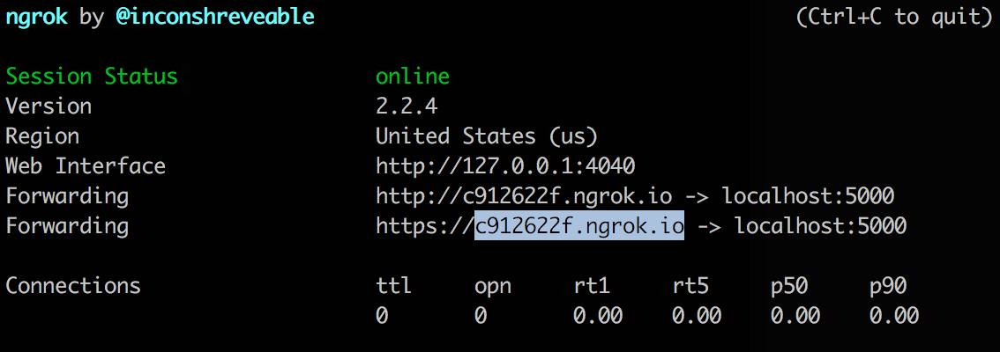

# Auth0 Simple Custom Database Connection Demo

A REST service that serves up a simple user store that can be accessed using an Auth0 [Custom Database Connection](https://auth0.com/docs/connections/database/mysql). The service will also return user permissions, which can optionally be accessed using an Auth0 [Rule](https://auth0.com/docs/rule).

The service runs locally and is exposed using [ngrok](https://ngrok.com/) so it can be accessed externally (example: from Auth0).

## User Data

User data is stored in the [users.json](./users.json) file and can be modified to suit your demo.

## API Security

This API uses a simple API key to authorize external access. More sophisticated approaches could be used like [validating an OAuth2 access token](https://auth0.com/docs/api-auth/grant/client-credentials).

## Local Setup

Install Node dependencies

```bash
npm install
```

## Run

1. Run the local server

   ```bash
   npm start
   ```

2. Run ngrok so the local server can be accessed remotely

   ```bash
   npm run ngrok
   ```

   >**NOTE:** Run ngrok in a separate terminal window so you can easily restart the Node.js server without restarting ngrok. This keeps you from having to update callers with new ngrok hostnames.

3. Copy the ngrok hostname:

   

## Settings

These are used by Postman and Auth0 in the remaining sections.

| Key | Value |
|---|---|
| `API_HOSTNAME` | (ngrok hostname obtained above) |
| `API_KEY` | `123abcXYZ` |

## Testing with Postman

You can easily call the service directly with Postman to make sure it's working. Follow these steps to set it up:

1. Import the [Auth0 Simple Custom Database Connection](./postman/auth0-simple-custom-db-connection_collection.json) Postman collection

2. Create Postman environment variables with keys and values from the [Settings](#settings) section above.

## Auth0 Configuration

The ultimate goal is to configure Auth0 to use the custom database:

1. Create a **Custom Database Connection** with this [Login script](./auth0-deploy/database-connections/custom-user-store/login.js) and the above [Settings](#settings)

2. Optionally create a **Rule** called `load-user-permissions` with [this code](./auth0-deploy/rules/load-user-permissions.js) and the above [Settings](#settings)

